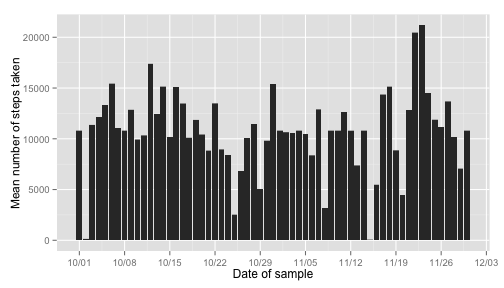

Reproducible Research: Peer Assessment 1
========================================
by Mario Gamboa

## Loading and preprocessing the data
Data is loaded directly from the source specified on the assignment, this assures the raw information is used as part of the analysis. Nevertheless, once downloaded and for performance reasons, a check is performed and if the data exists locally, it is used from the local store.


```r
rawURL = "https://d396qusza40orc.cloudfront.net/repdata%2Fdata%2Factivity.zip"

if (!file.exists("activity.zip")) {
      download.file(url = rawURL, destfile = "activity.zip", method = "curl")
}

### Check for existing datafile, unzip if needed
if(!file.exists("data")) { dir.create("data") }

if (!file.exists("data/activity.csv")){
      unzip(zipfile = "activity.zip", exdir = "data", overwrite = TRUE)
}
```

After the initial raw data is on a local file, load the data and cleanup some of the information to assign the correct data types. The time interval 


```r
activityDS        <- read.csv("data/activity.csv")
activityDS$date   <- as.Date(activityDS$date)
activityDS$dateTime   <- as.POSIXct(paste(activityDS$date, "GMT"), tz="GMT")
activityDS$dateTime <- activityDS$dateTime + as.difftime(activityDS$interval, units="mins")
```

## What is mean total number of steps taken per day?
The number of steps taken per day is calculaed with an aggregate function


```r
library(stats)
dailySteps <- aggregate( steps~date, activityDS, FUN=sum, na.rm=TRUE )
```

A historam plot of the information shows steps taken per day

```r
library(scales)
library(ggplot2)

qplot(date, steps, data=dailySteps, geom="blank") + 
      geom_bar(stat = "identity") +
      xlab("Date of sample")+
      ylab("Mean number of steps taken")+
      scale_x_date(labels = date_format("%m/%d"), 
            breaks = date_breaks("week"))
```

 

The mean and median of steps taken per day is calculated using *data.table* functions for simplicity. It is interesting to see how the median for each of the dates is zero, this is caused by the large number of observations with zero value on the dataset.


```r
library(data.table)

dt <- data.table(activityDS)
dt[!is.na(steps),
   list(count=length(steps), 
      sum=sum(steps),
      mean=mean(steps),
      median=median(steps)),
   by=date]
```

```
##           date count   sum    mean median
##  1: 2012-10-02   288   126  0.4375      0
##  2: 2012-10-03   288 11352 39.4167      0
##  3: 2012-10-04   288 12116 42.0694      0
##  4: 2012-10-05   288 13294 46.1597      0
##  5: 2012-10-06   288 15420 53.5417      0
##  6: 2012-10-07   288 11015 38.2465      0
##  7: 2012-10-09   288 12811 44.4826      0
##  8: 2012-10-10   288  9900 34.3750      0
##  9: 2012-10-11   288 10304 35.7778      0
## 10: 2012-10-12   288 17382 60.3542      0
## 11: 2012-10-13   288 12426 43.1458      0
## 12: 2012-10-14   288 15098 52.4236      0
## 13: 2012-10-15   288 10139 35.2049      0
## 14: 2012-10-16   288 15084 52.3750      0
## 15: 2012-10-17   288 13452 46.7083      0
## 16: 2012-10-18   288 10056 34.9167      0
## 17: 2012-10-19   288 11829 41.0729      0
## 18: 2012-10-20   288 10395 36.0938      0
## 19: 2012-10-21   288  8821 30.6285      0
## 20: 2012-10-22   288 13460 46.7361      0
## 21: 2012-10-23   288  8918 30.9653      0
## 22: 2012-10-24   288  8355 29.0104      0
## 23: 2012-10-25   288  2492  8.6528      0
## 24: 2012-10-26   288  6778 23.5347      0
## 25: 2012-10-27   288 10119 35.1354      0
## 26: 2012-10-28   288 11458 39.7847      0
## 27: 2012-10-29   288  5018 17.4236      0
## 28: 2012-10-30   288  9819 34.0938      0
## 29: 2012-10-31   288 15414 53.5208      0
## 30: 2012-11-02   288 10600 36.8056      0
## 31: 2012-11-03   288 10571 36.7049      0
## 32: 2012-11-05   288 10439 36.2465      0
## 33: 2012-11-06   288  8334 28.9375      0
## 34: 2012-11-07   288 12883 44.7326      0
## 35: 2012-11-08   288  3219 11.1771      0
## 36: 2012-11-11   288 12608 43.7778      0
## 37: 2012-11-12   288 10765 37.3785      0
## 38: 2012-11-13   288  7336 25.4722      0
## 39: 2012-11-15   288    41  0.1424      0
## 40: 2012-11-16   288  5441 18.8924      0
## 41: 2012-11-17   288 14339 49.7882      0
## 42: 2012-11-18   288 15110 52.4653      0
## 43: 2012-11-19   288  8841 30.6979      0
## 44: 2012-11-20   288  4472 15.5278      0
## 45: 2012-11-21   288 12787 44.3993      0
## 46: 2012-11-22   288 20427 70.9271      0
## 47: 2012-11-23   288 21194 73.5903      0
## 48: 2012-11-24   288 14478 50.2708      0
## 49: 2012-11-25   288 11834 41.0903      0
## 50: 2012-11-26   288 11162 38.7569      0
## 51: 2012-11-27   288 13646 47.3819      0
## 52: 2012-11-28   288 10183 35.3576      0
## 53: 2012-11-29   288  7047 24.4688      0
##           date count   sum    mean median
```

## What is the average daily activity pattern?
Calculate the average number of steps taken per interval on the data series. This information to properly plot the information.


```r
intervalSteps <- aggregate( steps~interval, activityDS, FUN=mean, na.rm=TRUE )
```

Create the plot with the information to identify which part of the day registers the maximum number of steps.


```r
qplot(interval, steps, data=intervalSteps, geom="blank") +
      geom_bar(stat = "identity") +
      xlab("Time of sample")+
      ylab("Mean number of steps per Interval")+
      scale_x_continuous(breaks = seq(from=0, to=2355, by=120))
```

 

The interval with the highest average number of steps can be easily calculated form the *intervalSteps* dataframe calculated earlier.

```r
maxStepsInterval <- intervalSteps[which.max(intervalSteps$steps), ]
timeInterval <- strftime(
      as.POSIXct("2000-01-01 0:0:0") +as.difftime(maxStepsInterval[1,1],units="mins"),
      format="%I:%M:%S %p")
```
The time interval which corrsponds to the maximum average steps is 835, expresed on time format that corresponds to **01:55:00 PM**.


## Imputing missing values
* Calculate and report the total number of missing values in the dataset (i.e. the total number of rows with NAs):

```r
countNA <- sum(is.na(activityDS))
```
there are **2304** missing values on the dataset.  

* Repair the dataset by filling in the NA values with the average information for the corresponding 5 minute interval on the whole dataset. That is used to avoid skewing of informtation by having NA values. Then a new dataset is created with the updated information.


```r
newADS <- merge(activityDS, intervalSteps, by="interval")
newADS$steps.x[is.na(newADS$steps.x)] <- newADS[is.na(newADS$steps.x),5]
newADS <- newADS[c(2,3,1,4)]
names(newADS) <- c("steps","date","interval","dateTime")
```

Make a histogram of the total number of steps taken each day and Calculate and report the mean and median total number of steps taken per day. Do these values differ from the estimates from the first part of the assignment? What is the impact of imputing missing data on the estimates of the total daily number of steps?

The results show a very similar histogram, but the median per day has changed.


```r
dailySteps <- aggregate( steps~date, newADS, FUN=sum, na.rm=TRUE )

qplot(date, steps, data=newADS, geom="blank") + 
      geom_bar(stat = "identity") +
      xlab("Date of sample")+
      ylab("Mean number of steps taken")+
      scale_x_date(labels = date_format("%m/%d"), 
            breaks = date_breaks("week"))
```

 

Some days now present medians other than zero as it was on the original dataset.

```r
dt <- data.table(newADS[order(newADS$date),])
dt[!is.na(steps),
   list(count=length(steps), 
      sum=sum(steps),
      mean=mean(steps),
      median=median(steps)),
   by=date]
```

```
##           date count   sum    mean median
##  1: 2012-10-01   288 10766 37.3826  34.11
##  2: 2012-10-02   288   126  0.4375   0.00
##  3: 2012-10-03   288 11352 39.4167   0.00
##  4: 2012-10-04   288 12116 42.0694   0.00
##  5: 2012-10-05   288 13294 46.1597   0.00
##  6: 2012-10-06   288 15420 53.5417   0.00
##  7: 2012-10-07   288 11015 38.2465   0.00
##  8: 2012-10-08   288 10766 37.3826  34.11
##  9: 2012-10-09   288 12811 44.4826   0.00
## 10: 2012-10-10   288  9900 34.3750   0.00
## 11: 2012-10-11   288 10304 35.7778   0.00
## 12: 2012-10-12   288 17382 60.3542   0.00
## 13: 2012-10-13   288 12426 43.1458   0.00
## 14: 2012-10-14   288 15098 52.4236   0.00
## 15: 2012-10-15   288 10139 35.2049   0.00
## 16: 2012-10-16   288 15084 52.3750   0.00
## 17: 2012-10-17   288 13452 46.7083   0.00
## 18: 2012-10-18   288 10056 34.9167   0.00
## 19: 2012-10-19   288 11829 41.0729   0.00
## 20: 2012-10-20   288 10395 36.0938   0.00
## 21: 2012-10-21   288  8821 30.6285   0.00
## 22: 2012-10-22   288 13460 46.7361   0.00
## 23: 2012-10-23   288  8918 30.9653   0.00
## 24: 2012-10-24   288  8355 29.0104   0.00
## 25: 2012-10-25   288  2492  8.6528   0.00
## 26: 2012-10-26   288  6778 23.5347   0.00
## 27: 2012-10-27   288 10119 35.1354   0.00
## 28: 2012-10-28   288 11458 39.7847   0.00
## 29: 2012-10-29   288  5018 17.4236   0.00
## 30: 2012-10-30   288  9819 34.0938   0.00
## 31: 2012-10-31   288 15414 53.5208   0.00
## 32: 2012-11-01   288 10766 37.3826  34.11
## 33: 2012-11-02   288 10600 36.8056   0.00
## 34: 2012-11-03   288 10571 36.7049   0.00
## 35: 2012-11-04   288 10766 37.3826  34.11
## 36: 2012-11-05   288 10439 36.2465   0.00
## 37: 2012-11-06   288  8334 28.9375   0.00
## 38: 2012-11-07   288 12883 44.7326   0.00
## 39: 2012-11-08   288  3219 11.1771   0.00
## 40: 2012-11-09   288 10766 37.3826  34.11
## 41: 2012-11-10   288 10766 37.3826  34.11
## 42: 2012-11-11   288 12608 43.7778   0.00
## 43: 2012-11-12   288 10765 37.3785   0.00
## 44: 2012-11-13   288  7336 25.4722   0.00
## 45: 2012-11-14   288 10766 37.3826  34.11
## 46: 2012-11-15   288    41  0.1424   0.00
## 47: 2012-11-16   288  5441 18.8924   0.00
## 48: 2012-11-17   288 14339 49.7882   0.00
## 49: 2012-11-18   288 15110 52.4653   0.00
## 50: 2012-11-19   288  8841 30.6979   0.00
## 51: 2012-11-20   288  4472 15.5278   0.00
## 52: 2012-11-21   288 12787 44.3993   0.00
## 53: 2012-11-22   288 20427 70.9271   0.00
## 54: 2012-11-23   288 21194 73.5903   0.00
## 55: 2012-11-24   288 14478 50.2708   0.00
## 56: 2012-11-25   288 11834 41.0903   0.00
## 57: 2012-11-26   288 11162 38.7569   0.00
## 58: 2012-11-27   288 13646 47.3819   0.00
## 59: 2012-11-28   288 10183 35.3576   0.00
## 60: 2012-11-29   288  7047 24.4688   0.00
## 61: 2012-11-30   288 10766 37.3826  34.11
##           date count   sum    mean median
```


## Are there differences in activity patterns between weekdays and weekends?
*Create a new factor variable in the dataset with two levels – “weekday” and “weekend” indicating whether a given date is a weekday or weekend day.* The new dataset now properly marks which observations correspond to weekday vs weekend.


```r
newADS$dayType <- "weekday"
newADS$dayType[weekdays(newADS$date)=="Sunday"] <- "weekend"
newADS$dayType[weekdays(newADS$date)=="Saturday"] <- "weekend"
newADS$dayType <- as.factor(newADS$dayType)
```


The panel plot showing the information presents differences between weekday and weekend observations. The activity over the weekend is less pronounced at a certain time during the day (lunch time?) but it is more spread throught the day.

```r
intervalSteps2 <- aggregate( steps~interval+dayType, newADS, FUN=mean, na.rm=TRUE )

ggplot(data = intervalSteps2, aes(y=steps, x=interval, group = dayType, color=dayType)) + 
      geom_line() +
      ggtitle("Activity Differences") +  
      facet_grid(dayType ~ .) +       
      labs(x="Interval", 
           y="Number of steps")          
```

 

Further analysis is necessary to determine specific causes for this differences.
